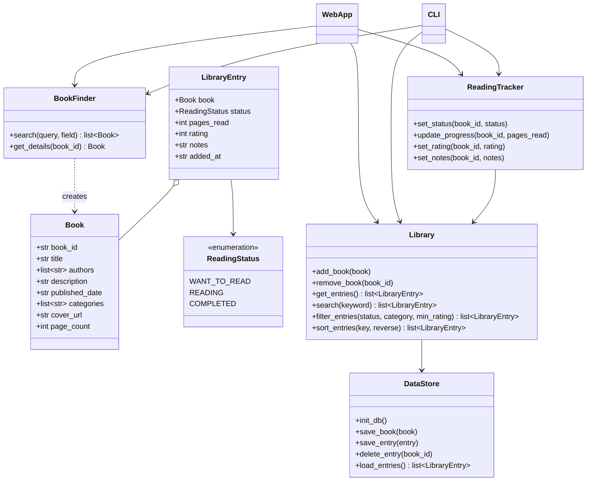

# Project Plan: BookLog

| | |
|---|---|
| **Course** | CP352301 Script Programming — Final Project (Semester 1/2569) |
| **Project** | BookLog |
| **Team** | Phattharawadee Songsrirod, Sujeephon Poobanchuen |

---

## 1. Introduction

### Problem
Readers keep their reading lists in notes apps, spreadsheets, or just in their heads. These lists do not include book information, do not track reading progress, and are hard to search, filter, or sort.

### Solution
BookLog is a Python application that puts the whole reading workflow in one place:

- Search for books by title, author, or genre using the Google Books API.
- View book details (title, author, description, published date, categories, cover).
- Save books to a personal library.
- Track each book as **Want to Read**, **Reading**, or **Completed**, with reading progress.
- Add a personal rating and notes.
- Search, filter, and sort the personal library.
- Keep everything in SQLite so the library is still there the next time the app starts.

### Value to the user
One organized, searchable library that remembers what they want to read, what they are reading, what they finished, and what they thought about it.

### Project approach
The project follows the four sprints of the course. Each sprint builds on the previous one:

1. **Sprint 1** — this plan and a CLI front-end to explore the structure.
2. **Sprint 2** — the back-end (business logic, data access, Google Books, search/filter/sort).
3. **Sprint 3** — a full-stack **web application** that connects the front-end and back-end.
4. **Final Sprint** — automated testing, CI/CD, and an AI-assisted feature.

---

## 2. Objectives

- Build the application with OOP and a modular, layered architecture (Presentation / Business Logic / Data Access).
- Persist the user's library and reading data in SQLite.
- Implement our own search, filter, and sort logic for the personal library.
- Retrieve book data from the Google Books API.
- Handle errors robustly: invalid input, custom exceptions, API failures, missing or corrupted database files.
- Provide a web interface (Streamlit) that reuses the same business logic as the CLI.
- Add automated tests (pytest), a CI/CD pipeline (GitHub Actions), and an AI-assisted feature.
- Keep clear documentation: this plan, a report per sprint, and a changelog per sprint.

---

## 3. Scope

### 3.1 Search Books
- Search by **title**, **author**, or **genre** using the Google Books API (`intitle:`, `inauthor:`, `subject:` search terms).
- Show a list of matching books.
- Handle empty search text, no results, and API or network errors.

### 3.2 Book Details
- Show title, author(s), description, published date, categories, and cover.
- The cover is shown as a URL in the CLI and as an image in the web app.
- Missing fields show a clear placeholder (for example "No description available") instead of crashing.

### 3.3 My Library
- Add a book from the search results to the personal library.
- Remove a book from the library.
- View all books in the library.
- A book can only be in the library once (identified by its Google Books ID).
- Saved book information is kept locally, so the library can be viewed without a network connection.

### 3.4 Reading Tracker
- Status for each book: `Want to Read`, `Reading`, `Completed`.
- Track progress as pages read (and percentage when the page count is known).
- Rules: progress cannot be negative or higher than the page count; marking a book as `Completed` sets progress to 100% when the page count is known.

### 3.5 Rating & Notes
- Personal rating from 1 to 5.
- Free-text notes about the book.
- Both can be edited or cleared later.

### 3.6 Search / Filter / Sort (personal library)
This part is implemented in our own code, not delegated to the API.

- **Search:** keyword in title, author, or category (case-insensitive).
- **Filter:** by reading status, category, and minimum rating.
- **Sort:** by rating, published year, title, or date added, ascending or descending.
- Books with missing values (no rating, no published date) are placed last when sorting.
- Published dates can be `YYYY`, `YYYY-MM`, or `YYYY-MM-DD`; sorting by year must handle all three.

### 3.7 Data Persistence (SQLite)
- Store books and library entries (status, progress, rating, notes) in a SQLite database.
- Create the database automatically if it does not exist.
- Detect a corrupted database file, keep a backup of it, and create a fresh database.

### 3.8 Priorities

| Priority | Features |
|---|---|
| **Must have** | Search books, book details, add/remove books, reading status, SQLite persistence, local search/filter/sort |
| **Should have** | Reading progress, rating and notes, Google Books integration polish (missing data handling) |
| **Could have** | AI-assisted feature, cover images in the web app, statistics page |

### 3.9 Out of scope
User accounts and login, multiple users, importing from other book sites, social features, mobile app, and cloud hosting.

---

## 4. High-Level Design

The application follows a layered architecture:

```text
Presentation Layer      CLI (Sprint 1)  →  Streamlit web app (Sprint 3)
          ↓
Business Logic Layer    BookFinder · Library · ReadingTracker · models · exceptions
          ↓
Data Access Layer       DataStore (SQLite)  ·  Google Books API (used by BookFinder)
```

### Layer rules
- The **Presentation Layer** only handles input and display. It never runs SQL or calls the API directly.
- The **Business Logic Layer** holds the rules and algorithms. It never prints or reads input, so the same code works for the CLI and the web app.
- The **Data Access Layer** is the only place that talks to SQLite. All SQL lives in `DataStore`.
- Each class receives the objects it needs through its constructor, so classes can be tested with a temporary database or a fake API.

### Design patterns
- **Layered architecture** (Separation of Concerns).
- **Repository pattern:** `DataStore` hides the database details from the business logic.
- **Dependency injection:** `Library`, `ReadingTracker`, and the UI receive their dependencies instead of creating them.
- **Enumeration:** `ReadingStatus` keeps status values consistent.

---

## 5. OOP Design

| Class | Layer | Responsibility |
|---|---|---|
| `Book` | Business Logic (model) | Book information: id, title, authors, description, published date, categories, cover URL, page count |
| `ReadingStatus` | Business Logic (model) | Enum: `WANT_TO_READ`, `READING`, `COMPLETED` |
| `LibraryEntry` | Business Logic (model) | A book in the library plus status, pages read, rating, notes, date added |
| `BookFinder` | Business Logic | Searches Google Books, converts API responses into `Book` objects, handles missing fields and API errors |
| `Library` | Business Logic | Add/remove/view entries; own search, filter, and sort algorithms |
| `ReadingTracker` | Business Logic | Changes status, progress, rating, and notes; enforces the reading rules |
| `DataStore` | Data Access | Creates the SQLite database; saves, loads, and deletes books and entries; recovers from a corrupted file |
| `CLI` | Presentation | Menus, input validation, and display (Sprint 1) |
| Streamlit app | Presentation | Web pages that call the same business logic (Sprint 3) |
| Custom exceptions | Business Logic | `BookLibraryError` (base), `BookNotFoundError`, `DuplicateBookError`, `InvalidRatingError`, `InvalidProgressError`, `APIError`, `DatabaseError` |

### UML Class Diagram (draft — finalized in Sprint 2)



---

## 6. Data Model (SQLite — draft, finalized in Sprint 2)

```sql
CREATE TABLE books (
    book_id        TEXT PRIMARY KEY,          -- Google Books volume ID
    title          TEXT NOT NULL,
    authors        TEXT,                      -- comma-separated
    description    TEXT,
    published_date TEXT,                      -- YYYY, YYYY-MM, or YYYY-MM-DD
    categories     TEXT,                      -- comma-separated
    cover_url      TEXT,
    page_count     INTEGER
);

CREATE TABLE library_entries (
    book_id    TEXT PRIMARY KEY REFERENCES books(book_id) ON DELETE CASCADE,
    status     TEXT NOT NULL CHECK (status IN ('want_to_read', 'reading', 'completed')),
    pages_read INTEGER NOT NULL DEFAULT 0 CHECK (pages_read >= 0),
    rating     INTEGER CHECK (rating BETWEEN 1 AND 5),
    notes      TEXT,
    added_at   TEXT NOT NULL
);
```

Using the Google Books ID as the key prevents duplicate books, and keeping the book details in `books` lets the library work offline.

---

## 7. Technology Stack

| Item | Choice |
|---|---|
| Language | Python 3.10 or newer |
| Book data | Google Books API via `requests` |
| Database | SQLite (`sqlite3`, Python standard library) |
| Web interface (Sprint 3) | Streamlit |
| Testing | pytest |
| Linting | ruff |
| CI/CD | GitHub Actions |
| Version control | Git and GitHub |

The Google Books API key (if one is used) is read from the `GOOGLE_BOOKS_API_KEY` environment variable and is never committed to the repository.

---

## 8. Project Structure

Each `SprintN/` folder is a runnable snapshot of the project at the end of that sprint.

```text
book-library-manager/
├── README.md
├── PLAN.md                    # one plan for the whole project
├── requirements.txt
├── .gitignore                 # __pycache__/, *.db, .env
│
├── Sprint1/                   # CLI front-end with mock data
│   ├── CHANGELOG.md
│   ├── Sprint1_Report.md      # progress, QA table, Wow!/Whoops!
│   ├── main.py
│   └── src/
│       ├── cli.py
│       └── mock_data.py
│
├── Sprint2/                   # back-end
│   ├── CHANGELOG.md
│   ├── Sprint2_Report.md
│   ├── main.py
│   ├── data/seed_books.json   # test dataset for the algorithm demo
│   ├── src/
│   │   ├── models.py
│   │   ├── exceptions.py
│   │   ├── book_finder.py
│   │   ├── library.py
│   │   ├── reading_tracker.py
│   │   └── data_store.py
│   └── tests/
│
├── Sprint3/                   # full-stack web app
│   ├── CHANGELOG.md
│   ├── Sprint3_Report.md
│   ├── app.py                 # Streamlit
│   ├── src/
│   └── tests/
│
└── .github/workflows/ci.yml   # Final Sprint: lint + tests
```

---

## 9. Development Sprints

| Sprint | Focus | Presentation | Submission |
|---|---|---|---|
| Sprint 1 | Plan + CLI front-end | — | Ready in the repository by 25 Sep 2026 (restarted with this topic) |
| Sprint 2 | Back-end | 29–30 Sep 2026 (together with Sprint 3) | 25 Sep 2026 |
| Sprint 3 | Full-stack web app | 29–30 Sep 2026 | 2 Oct 2026 |
| Final Sprint | Testing, CI/CD, AI | 6–7 Oct 2026 | 16 Oct 2026 |

### Sprint 1 — Plan and CLI Front-End
**Goal:** Write the project plan and build the CLI to see how the application will be structured.

Tasks:
- Write this `PLAN.md` and the Definition of Done.
- Build the CLI: welcome message, main menu, command input handling (`.strip().lower()`), and input validation with `try-except ValueError`.
- Search books and show book details using **mock data**.
- Add to and remove from the library, and update status, progress, rating, and notes — in memory only.
- Manual testing of edge cases; write `Sprint1_Report.md` (including Wow!/Whoops!) and `CHANGELOG.md` (0.1.0); open a Pull Request.

Planned main menu:

```text
1. Search Books
2. My Library      (view / update status and progress / rate and add notes / remove)
3. Exit
```

### Sprint 2 — Back-End
**Goal:** Build the business logic and data access layers.

Tasks:
- Create the models (`Book`, `LibraryEntry`, `ReadingStatus`) and the custom exceptions.
- Build `BookFinder` with the Google Books API, including error handling and missing data.
- Build `DataStore` with SQLite (auto-create, save, load, delete, recover from corruption).
- Build `Library` with our own search, filter, and sort algorithms.
- Build `ReadingTracker` with the reading rules.
- Prepare a seed dataset (hundreds of books) and measure search/filter/sort time.
- Write pytest tests for the core logic (using a temporary database).
- Update `PLAN.md` with the final UML class diagram and schema.
- Write `Sprint2_Report.md` (QA log, Wow!/Whoops!) and `CHANGELOG.md` (0.2.0); open a Pull Request.

### Sprint 3 — Full-Stack Web Application
**Goal:** Connect the front-end and back-end into one complete web application.

Tasks:
- Build the Streamlit app: Search, Book Details, My Library, Reading Tracker, Rating & Notes, and Filter/Sort pages.
- Connect every page to the business logic (no SQL or business rules in the UI).
- Manage application state so the screen always matches the database (data consistency).
- Test edge cases and harden error handling (API down, empty library, missing database, invalid input).
- Write `Sprint3_Report.md` and `CHANGELOG.md` (0.3.0); open a Pull Request.

### Final Sprint — Testing, CI/CD, and AI Integration
**Goal:** Prepare the application for the final demonstration.

Tasks:
- Complete the automated test suite with pytest.
- Configure GitHub Actions to run ruff (linting) and pytest on every push and pull request.
- Add an AI-assisted feature. Candidate: book recommendations based on the user's ratings and categories. The final choice is confirmed at the start of this sprint.
- Final debugging, refactoring, and documentation.
- Prepare the final presentation and demo. Release `CHANGELOG.md` 1.0.0.

---

## 10. Definition of Done

### 10.1 Project-wide
A feature is done when:

- [ ] It works according to its requirement through the intended interface (CLI or web).
- [ ] User input is validated and invalid input never crashes the program.
- [ ] Errors are handled with clear messages (custom exceptions in the business logic).
- [ ] Code follows the layered OOP structure (no business logic in the UI, no SQL outside `DataStore`).
- [ ] Data is stored correctly and is still there after restarting the application.
- [ ] Functions and classes have docstrings, names are meaningful, and code follows PEP 8.
- [ ] Important behavior is covered by tests (manual QA in Sprint 1, pytest from Sprint 2).
- [ ] The sprint report, retrospective (Wow!/Whoops!), and sprint `CHANGELOG.md` are updated.
- [ ] The work is delivered through a Pull Request.

### 10.2 Sprint 1 (CLI)
- [ ] Typing `quit` in any letter case and with extra spaces (`QUIT`, ` Quit `) exits the program immediately with a goodbye message.
- [ ] A non-numeric, negative, or out-of-range menu choice shows a message and asks again without crashing.
- [ ] An empty search shows a message and lets the user try again or go back.
- [ ] Searching mock data by title, author, or genre lists the matching books; selecting one shows its details.
- [ ] A book can be added to and removed from the in-memory library, and its status, progress, rating, and notes can be changed.
- [ ] Rating outside 1–5 and invalid progress are rejected with a message.
- [ ] Every function has a docstring; code is split into functions/classes (display, input, main).
- [ ] `Sprint1_Report.md` includes the QA table (Observation / Expected / Actual) and Wow!/Whoops!; `CHANGELOG.md` has version 0.1.0.

### 10.3 Sprint 2 (Back-End)
- [ ] Books and library entries are saved to SQLite and are all present after restarting the program.
- [ ] A missing database file is created automatically; a corrupted database is backed up and replaced, with a clear message and no crash.
- [ ] Adding a duplicate book raises `DuplicateBookError`; removing or updating a book that is not in the library raises `BookNotFoundError`. Both are handled without a crash.
- [ ] Ratings outside 1–5 and progress below 0 or above the page count are rejected.
- [ ] Marking a book `Completed` sets progress to the page count (when known).
- [ ] Library search (title, author, category) is case-insensitive and handles empty keywords.
- [ ] Filter by status, category, and minimum rating works alone and combined.
- [ ] Sort by rating, published year, title, and date added works in both directions; books with missing values are placed last; all three date formats are handled.
- [ ] Google Books search returns `Book` objects; a timeout, no network, or a bad response raises `APIError`, is handled, and the rest of the app keeps working.
- [ ] Search/filter/sort time is measured on the seed dataset and recorded in the report.
- [ ] pytest tests for the core logic and `DataStore` (temporary database) pass.
- [ ] `PLAN.md` is updated with the final UML class diagram and schema.
- [ ] `Sprint2_Report.md` includes the QA log and Wow!/Whoops!; `CHANGELOG.md` has version 0.2.0.

### 10.4 Sprint 3 (Full-Stack)
- [ ] The web app starts with `streamlit run app.py` and every core feature is usable from the browser.
- [ ] All UI actions call business logic methods; the UI contains no SQL and no business rules.
- [ ] After adding, removing, or updating a book, the screen and the database agree, including after a page refresh and after restarting the app.
- [ ] Invalid input in the web forms shows a friendly message and does not crash the app.
- [ ] Edge cases are tested: API unavailable, empty library, missing or corrupted database, books with missing fields.
- [ ] `Sprint3_Report.md` includes the QA log and Wow!/Whoops!; `CHANGELOG.md` has version 0.3.0.

### 10.5 Final Sprint
- [ ] The pytest suite covers the core logic and passes.
- [ ] GitHub Actions runs ruff and pytest on every push and pull request, and the pipeline passes.
- [ ] The AI-assisted feature works in the demo.
- [ ] Documentation, changelog, and presentation are complete.

---

## 11. Error Handling Plan

| Situation | Expected behavior |
|---|---|
| Command typed in any letter case or with extra spaces | Recognized normally |
| Menu choice is not a number, is negative, or is out of range | Message shown, prompt again, no crash |
| Empty search text | Message shown; try again or go back |
| No books found | "No books found" message |
| Google Books unreachable, timeout, or bad response | `APIError` handled; friendly message; library still usable |
| Book has missing fields | Placeholder shown; sorted last; no crash |
| Adding a book that is already in the library | `DuplicateBookError` handled with a message |
| Removing or updating a book that is not in the library | `BookNotFoundError` handled with a message |
| Rating not an integer from 1 to 5 | `InvalidRatingError`; value rejected |
| Pages read negative or above the page count | `InvalidProgressError`; value rejected |
| SQLite file missing | Created automatically with empty tables |
| SQLite file corrupted | `DatabaseError` handled; damaged file backed up; new database created; user informed |

---

## 12. Team and Workflow

- **Members:** Phattharawadee Songsrirod, Sujeephon Poobanchuen.
- **Roles:** Sprint 1 — Phattharawadee Songsrirod is Planner, Sujeephon Poobanchuen is Coder/Debugger. From Sprint 2 through the Final Sprint, both members work as Coder and Debugger (no separate Planner role for these sprints; planning tasks are handled jointly and noted in each sprint's report).
- **Sprint cycle:** Planning (Monday) → Execution (mid-week) → Review and handoff (Friday).
- **Git workflow:** one branch per sprint (`sprint-1`, `sprint-2`, `sprint-3`), merged through a Pull Request. Each Pull Request includes the Wow! and Whoops! summary.
- **Documentation:** each sprint folder has its own `CHANGELOG.md` (Added / Changed / Fixed) and a sprint report that contains the QA log and the retrospective.
- **Bug reports:** written as Observation / Expected / Actual.
- **Secrets:** API keys are read from environment variables; `.env` files and database files are in `.gitignore`.

---

## 13. Risks and Mitigations

| Risk | Mitigation |
|---|---|
| Google Books is unreachable or rate-limited during development or the demo | Save book details in SQLite; keep a seed dataset (`seed_books.json`); show friendly errors |
| API data is inconsistent (missing fields, different date formats) | Normalize the data in `BookFinder`; handle missing values in sorting |
| Sprint 2 and Sprint 3 are presented together, so the time is short | Build the must-have features first; rating/notes polish and the AI feature come after |
| The web app takes longer than expected | Business logic is independent of the UI, so the CLI still works as a fallback |
| Team roles rotate between sprints | Keep interfaces and rules documented in this plan and in docstrings |

---

## 14. Expected Final Result

The final Book Library Manager will allow a user to:

1. Search for books by title, author, or genre.
2. View book details, including description, categories, and cover.
3. Save books to a personal library that persists in SQLite.
4. Track each book as Want to Read, Reading, or Completed, with reading progress.
5. Add a personal rating and notes.
6. Search, filter, and sort the library.
7. Use everything through a Streamlit web application.
8. Rely on an application backed by automated tests and a CI/CD pipeline, with an AI-assisted feature.